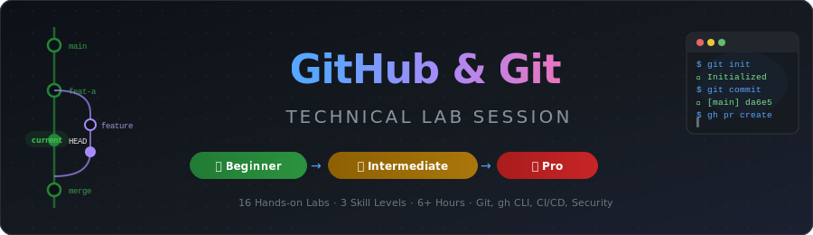
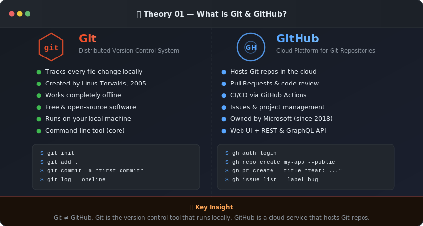
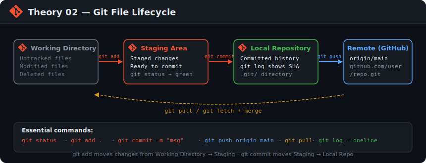
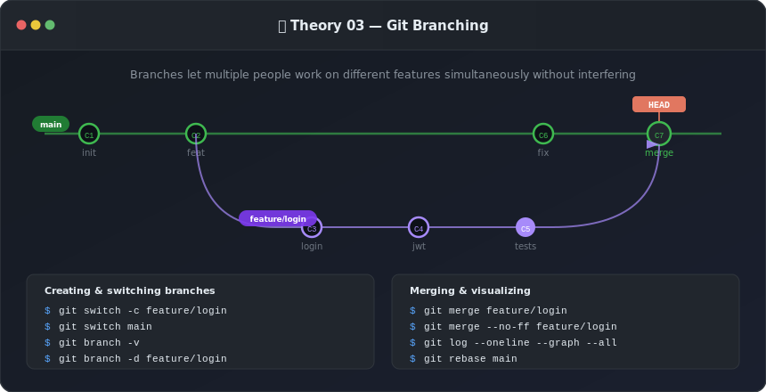
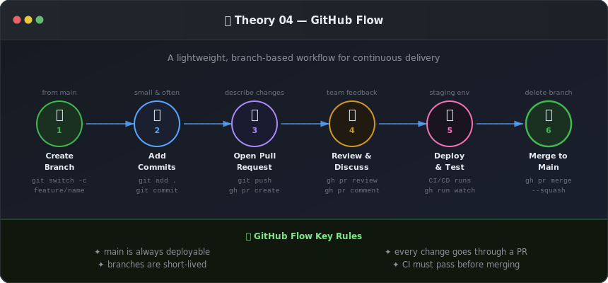

<div align="center">



<br/>

[](./beginner/)
[](./beginner/)
[](./intermediate/)
[](./pro/)
[](https://github.com/SenukDias/github-lab/actions)

</div>

---

## 📖 Theory — Read This Before You Start Any Lab

> These four concepts are the **foundation of everything** in this lab. Read each one carefully — the visual + explanation together. You will use this knowledge in every single lab that follows.

---

### 🔵 Theory 01 — What is Git? What is GitHub? Are they the same?



**Most beginners get this wrong on day one.** Git and GitHub are completely different things — one is a tool, the other is a service.

#### 🔶 Git — The Version Control Tool

**Git** is a free, open-source program you install on your computer. It does one job: **it tracks every change you make to files over time**. Think of it like a super-powered "Save" button that remembers every version of every file, forever.

- Created by **Linus Torvalds** in 2005 (the same person who created the Linux kernel)
- Runs **entirely on your machine** — no internet needed
- Stores history in a hidden folder called `.git` inside your project
- Every project tracked by Git is called a **repository** (or "repo")
- You talk to Git using terminal commands like `git add`, `git commit`, `git log`

**Without Git**, if you make a mistake, you lose your work. With Git, you can go back to any point in your project's history in seconds.

#### 🔷 GitHub — The Cloud Platform

**GitHub** is a website (owned by Microsoft) that stores your Git repositories in the cloud so your team can share them. Think of it like Google Drive — but specifically designed for code, with powerful extra features.

- Hosts your repos at `github.com/username/repo-name`
- Adds **Pull Requests** — a way to review code before merging it
- Adds **Issues** — a bug and task tracker built into your repo
- Adds **GitHub Actions** — automatic pipelines that run tests and deploy your code
- Has a **REST API** and a **CLI tool** called `gh`

> 💡 **The key mental model:** You use **Git** to save your work locally. You use **GitHub** to share that work with others. Git is the engine. GitHub is the garage where everyone parks their car.

| | **Git** | **GitHub** |
|--|---------|------------|
| Type | CLI tool | Cloud platform |
| Runs on | Your machine | The internet |
| Access | Terminal | Browser + REST API |
| Cost | Free always | Free tier + paid plans |
| Created by | Linus Torvalds | Tom Preston-Werner et al. |
| Alternatives | Mercurial, SVN | GitLab, Bitbucket, Azure DevOps |

```bash
# Git — local commands (no internet needed)
git init              # Start tracking a folder
git add .             # Stage changes
git commit -m "msg"   # Save a snapshot locally

# GitHub — cloud commands (internet needed)
git push              # Upload local commits to GitHub
git pull              # Download GitHub commits to local
gh repo create        # Create a new repo on github.com
gh pr create          # Open a Pull Request
```

---

### 🟡 Theory 02 — The Git File Lifecycle



**Before you can commit anything, you need to understand exactly how Git thinks about your files.** Every file in your project is always in one of four states — and you move files between these states using Git commands.

#### Stage 1 — Working Directory

This is your **normal project folder** — the files you edit with your code editor. When you create a new file or edit an existing one, the changes exist only in the Working Directory. Git sees them but does nothing with them automatically.

- New file you just created → **Untracked** (Git has never seen this file)
- File you edited → **Modified** (Git knows it changed)
- File you deleted → **Deleted**

```bash
# See what's in your working directory
git status
# Shows: Changes not staged, Untracked files
```

#### Stage 2 — Staging Area (Index)

The Staging Area is a **"waiting room"** between your edits and your commits. You explicitly choose which changes to stage — this gives you precise control over what goes into each commit.

This is Git's most important and most misunderstood feature. **You don't have to commit everything at once.** You can stage only specific files, or even specific lines within a file.

```bash
git add README.md          # Stage one file
git add src/               # Stage a whole folder
git add -p                 # Stage line-by-line (interactive — pro move)
git restore --staged file  # Unstage a file (undo git add)
```

#### Stage 3 — Local Repository

When you run `git commit`, Git takes everything in the Staging Area and creates a **permanent snapshot** stored inside the `.git` folder on your machine. This commit has:
- A unique ID (SHA hash) like `da6e560`
- Your name, email, and timestamp
- A message you wrote
- The exact state of all staged files

```bash
git commit -m "feat: add login page"   # Create a snapshot
git log --oneline                       # See all snapshots
git show da6e560                        # Inspect one snapshot
```

#### Stage 4 — Remote Repository (GitHub)

The commit now exists locally — only on your machine. To **share it with your team**, you push it to GitHub. The remote is just another copy of the repo, hosted in the cloud.

```bash
git push origin main    # Upload commits to GitHub
git pull origin main    # Download others' commits to your machine
git fetch               # Download without merging (safe look)
```

> 💡 **Why does the Staging Area exist?** It lets you make 10 small edits to 10 different files but commit them as 3 logical, separate commits. Clean history = easier debugging later.

```
You edit file  →  git add  →  git commit  →  git push
(Working Dir)    (Staging)    (Local Repo)   (GitHub)

Reverse:
git push ←──── git commit ←─── git add
github.com ──► git pull ──────────────────► Working Dir
```

---

### 🟢 Theory 03 — Branches: Parallel Universes for Your Code



**Branches are the single most powerful feature in Git.** They let you — and your whole team — work on completely different things at the same time, in the same repository, without breaking each other's work.

#### What is a Branch?

A branch is a **lightweight, movable pointer** to a specific commit. By default, every repo starts with one branch called `main`. When you create a new branch, Git creates a new pointer — it doesn't copy any files. This is why creating a branch in Git is nearly instant.

```
Before branching:         After branching:
                          
main: A → B → C           main:    A → B → C
                                             ↘
                           feature:           D → E
```

Each letter (`A`, `B`, `C`, `D`, `E`) is a commit. The feature branch diverges from `main` at commit `C`. The key insight: **commits `D` and `E` only exist on the feature branch** — `main` is completely unaffected.

#### HEAD — Where You Are Right Now

`HEAD` is a special pointer that tells Git "this is where I am right now." It always points to the currently active branch (or commit).

```bash
cat .git/HEAD          # See what HEAD points to
# ref: refs/heads/main

git log --oneline --all --graph   # Visualize all branches + HEAD
```

#### Working with Branches

```bash
# Create and switch in one command (modern syntax)
git switch -c feature/user-auth

# Go back to main
git switch main

# See all branches
git branch -v                     # Local branches
git branch -a                     # Local + remote branches
git branch --no-merged main       # Branches not yet merged

# Delete a branch after merging
git branch -d feature/user-auth
git push origin --delete feature/user-auth   # Delete on GitHub too
```

#### Merging — Bring It Back Together

When your feature is done, you **merge** it back into `main`. There are three merge strategies:

| Strategy | Creates merge commit? | History | Use when |
|----------|----------------------|---------|----------|
| Fast-forward | No | Linear | No new commits on main since branch |
| True merge | Yes (`--no-ff`) | Shows branch | Team feature work |
| Squash merge | Yes (one commit) | Very clean | Many WIP commits on branch |

```bash
git switch main
git merge feature/user-auth        # Merge (auto-decides strategy)
git merge --no-ff feature/ui       # Force a merge commit
git merge --squash feature/messy   # Squash all commits into one

# Rebase — replay commits on top of main (linear history)
git switch feature/user-auth
git rebase main                    # Rebase before opening PR
```

#### Professional Branch Naming

```bash
feature/user-authentication        # New feature
fix/login-redirect-bug             # Bug fix
hotfix/critical-payment-failure    # Urgent production fix
chore/upgrade-dependencies         # Maintenance
docs/update-api-readme             # Documentation
release/v2.1.0                     # Release branch
```

> 💡 **Rule of thumb:** `main` should always have working, deployable code. Every new piece of work — no matter how small — gets its own branch. This is not optional in a professional team.

---

### 🔴 Theory 04 — GitHub Flow: The Team Collaboration Cycle



**GitHub Flow is the workflow used by millions of professional teams worldwide.** It is a simple, repeatable 6-step cycle that keeps `main` always shippable while letting teams develop features in parallel.

> "Anything in the `main` branch is deployable." — GitHub's #1 rule

#### The 6-Step Cycle — In Detail

---

**① Create a Branch**

Never work directly on `main`. Before writing a single line of code, create a branch. The branch name should describe what you're building.

```bash
git switch main && git pull          # Always start from a fresh main
git switch -c feature/payment-gateway
```

*Why:* This isolates your work. If something goes wrong, `main` is untouched. Other people's work is untouched. You can safely experiment.

---

**② Add Commits**

Work on your feature. Commit small and often — each commit should be one logical change. Write clear commit messages using **Conventional Commits** format.

```bash
git add src/payment.py
git commit -m "feat(payment): add Stripe API client"

git add tests/test_payment.py
git commit -m "test(payment): add unit tests for payment flow"
```

*Why small commits?* Because if you introduce a bug, `git bisect` can find the exact commit in seconds. With one giant commit, you're searching for a needle in a haystack.

---

**③ Open a Pull Request**

When you're ready for feedback (or even if you're not — open a Draft PR early!), push your branch and open a Pull Request. The PR is a **discussion thread** attached to your diff.

```bash
git push -u origin feature/payment-gateway

gh pr create \
  --title "feat: add Stripe payment gateway" \
  --body "Closes #45. Adds payment processing via Stripe API." \
  --reviewer teammate1,teammate2
```

*Why:* PRs give your team visibility into what you're building. Problems get caught before they reach `main`.

---

**④ Review & Discuss**

Teammates review the code, leave comments, request changes. You push more commits to address feedback — they appear in the same PR automatically.

```bash
gh pr review 45 --comment --body "Can we add error handling for expired cards?"

# Address feedback, then push
git commit -m "fix(payment): handle expired card errors gracefully"
git push
```

*Why:* Code review is where 70% of bugs get caught. It also spreads knowledge — reviewers learn the codebase, authors learn best practices.

---

**⑤ Deploy & Test (CI/CD)**

GitHub Actions automatically runs tests, linting, and a staging deployment when you push. Everyone can see if the CI checks pass before merging.

```bash
# Watch your CI pipeline in the terminal
gh run watch

# Check run results
gh run list --branch feature/payment-gateway
```

*Why:* Automated tests catch what human reviewers miss. Deploying to staging first means production never sees untested code.

---

**⑥ Merge to Main**

Once the PR is approved and CI passes, merge it. Delete the feature branch — it's done its job.

```bash
gh pr merge 45 --squash --delete-branch

# Update your local main
git switch main && git pull
```

*Why squash merge?* It collapses all your WIP commits into one clean commit on `main`. The history stays readable.

---

#### Rules That Make GitHub Flow Work

| Rule | Why It Matters |
|------|----------------|
| `main` is always deployable | No "do not deploy on Friday" anxiety |
| Work in short-lived branches (< 2 days) | Less merge conflicts, faster feedback |
| Every change goes through a PR | Knowledge sharing + bug prevention |
| CI must pass before merging | Automated safety net |
| Delete branches after merging | Keeps repo clean and navigable |
| Link PRs to issues | Traceability — why was this changed? |

```bash
# The complete GitHub Flow in 7 commands:
git switch main && git pull                        # 1. Start fresh
git switch -c feature/your-feature                 # 2. Branch
# ... make changes, git add, git commit ...        # 3. Work + commit
git push -u origin feature/your-feature            # 4. Push
gh pr create --title "feat: ..." --body "..."      # 5. PR
# ... wait for review + CI ...
gh pr merge --squash --delete-branch               # 6. Merge
git switch main && git pull                        # 7. Sync
```

---

## 🚀 Start the Labs

You've read the theory. Now it's time to **do the work**.

<p align="center">
  <a href="./beginner/">
    
  </a>
  &nbsp;&nbsp;
  <a href="./intermediate/">
    
  </a>
  &nbsp;&nbsp;
  <a href="./pro/">
    
  </a>
</p>

> 🟢 **New to Git?** → Start with Beginner  
> 🟡 **Used Git before?** → Jump to Intermediate  
> 🔴 **Comfortable with PRs and Actions?** → Go straight to Pro

---

## 📂 Full Lab Structure

```
github-lab/
│
├── 🟢 beginner/
│   ├── lab-01-installation.md        Install Git & GitHub CLI (all OS)
│   ├── lab-02-configuration.md       Configure identity, editor, line endings
│   ├── lab-03-github-login.md        HTTPS, PAT, SSH — 3 auth methods
│   ├── lab-04-first-repo.md          Create repos via web + gh CLI
│   ├── lab-05-basic-commands.md      add · commit · push · pull · log · stash
│   └── lab-06-gitignore.md           Patterns, templates, removing tracked files
│
├── 🟡 intermediate/
│   ├── lab-07-branching.md           GitHub Flow, Git Flow, naming conventions
│   ├── lab-08-merging-rebasing.md    Merge vs Rebase, conflict resolution
│   ├── lab-09-pull-requests.md       Create, review, merge PRs via gh CLI
│   ├── lab-10-collaboration.md       Fork, upstream sync, issues, gists
│   └── lab-11-github-actions.md      Write CI workflows, triggers, secrets
│
├── 🔴 pro/
│   ├── lab-12-advanced-git.md        cherry-pick, bisect, reflog, worktrees
│   ├── lab-13-github-cli-pro.md      gh api, releases, scripting, extensions
│   ├── lab-14-git-hooks.md           pre-commit, commit-msg, pre-push, Husky
│   ├── lab-15-advanced-actions.md    Multi-job CI/CD, Docker build, environments
│   └── lab-16-security.md           Branch protection, CODEOWNERS, secret scanning
│
├── 📋 tasks/
│   ├── beginner-tasks.md             5 practical challenges + submission script
│   ├── intermediate-tasks.md         5 team simulation tasks
│   └── pro-tasks.md                  5 real-world engineering challenges
│
└── .github/workflows/
    └── lab-validator.yml             Validates structure on every push
```

---

## ⚡ Quick Reference Cheat Sheet

<details>
<summary><strong>🟢 Beginner Commands — Click to expand</strong></summary>

```bash
# One-time setup
git config --global user.name "Your Name"
git config --global user.email "you@example.com"
git config --global init.defaultBranch main
git config --global core.editor "code --wait"
gh auth login

# Create a repo
gh repo create my-app --public --clone
cd my-app

# Daily workflow
git status                    # What's changed?
git add .                     # Stage everything
git add -p                    # Stage interactively (best practice)
git commit -m "feat: msg"     # Commit with conventional message
git push                      # Upload to GitHub
git pull                      # Download from GitHub

# History & undo
git log --oneline --graph
git diff                      # Working dir vs staging
git diff --staged             # Staging vs last commit
git restore --staged file     # Unstage a file
git reset --soft HEAD~1       # Undo last commit, keep changes
git stash                     # Temp-save work in progress
git stash pop                 # Restore stashed work
```
</details>

<details>
<summary><strong>🟡 Intermediate Commands — Click to expand</strong></summary>

```bash
# Branches
git switch -c feature/name             # Create + switch to branch
git switch main && git pull            # Always pull before branching
git branch -v                          # List branches with last commit
git branch --no-merged main            # Unmerged branches
git branch -d feature/done             # Delete merged branch
git push origin --delete feature/done  # Delete from GitHub too

# Merging
git merge feature/name                 # Merge into current branch
git merge --no-ff feature/name         # Always create merge commit
git merge --squash feature/name        # Squash into one commit
git rebase main                        # Replay commits on top of main

# Pull Requests via gh CLI
gh pr create --title "feat: ..." --body "Closes #42"
gh pr list
gh pr view 42 --web
gh pr review 42 --approve
gh pr merge --squash --delete-branch

# Collaboration
gh repo fork owner/repo --clone --remote
git remote add upstream URL
git fetch upstream && git rebase upstream/main
gh issue create --title "Bug: ..." --label "bug"
gh issue close 5 --comment "Fixed in PR #12"
```
</details>

<details>
<summary><strong>🔴 Pro Commands — Click to expand</strong></summary>

```bash
# Advanced Git
git cherry-pick abc1234                # Apply a specific commit
git bisect start                       # Binary search for a bug
git bisect bad && git bisect good v1   # Mark good/bad commits
git bisect run npm test                # Auto-bisect with a test
git reflog                             # See all HEAD movements (time machine)
git reset --hard HEAD@{3}             # Go back to any reflog entry
git worktree add ../hotfix HEAD        # Check out branch in a separate folder

# Rebase mastery
git rebase -i HEAD~5                   # Interactive: squash/reword/reorder
git rebase --autosquash                # Auto-apply fixup! commits

# gh CLI scripting
gh api user --jq '.login'
gh api repos/{owner}/{repo}/issues --method POST --field title="..."
gh release create v1.0.0 --generate-notes
gh run list --workflow ci.yml --status failure
gh secret set API_KEY
gh variable set APP_ENV --body "production"

# Hooks
ls .git/hooks/                         # See available hooks
chmod +x .git/hooks/pre-commit         # Activate a hook
```
</details>

---

## 🛠️ Prerequisites

| Item | Requirement |
|------|-------------|
| OS | Windows 10+ / macOS 12+ / Ubuntu 20.04+ |
| GitHub account | [Sign up free →](https://github.com/signup) |
| Terminal | Git Bash (Windows), Terminal (macOS/Linux) |
| Editor | [VS Code](https://code.visualstudio.com/) recommended |
| Internet | Required for GitHub commands |

---

<div align="center">

*Made for the GitHub & Git Technical Session · Learn by doing · Star ⭐ if this helped you*

</div>

